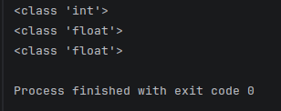

# MY PYTHON NOTES

## WE WILL WRITE THE NOTES HERE TO UNDERSTAND AND REVISE EVERYTHING FURTHER . WE WILL DESCRIBE EVERYTHING WITH THE REFERENCE OF THE FILE ABOVE THE DESCRPTION . AFTER THIS YOU CAN PROCEED WHAT YOU WAN TO LEARN AND HOW IT IS DESCRIBED IN THE RELATED Python FILE

### FILE: [IDENTIFIERS:](revision_python_gate/02_identifier.py)

- identifier is a name having a few letters , numbers and special characters_
- python is case-sensitive
- constant is identifier you can not see the concept of constant in python so you can not define a constant basically ,you have to ,manually think that this variable is a constant

### FILE: [VARIABLES:](revision_python_gate/03_variable.py)

- In python, you only bind a name to an object during assignment python consider value as objects
- memory allocation in python is based upon the value that variable carries not upon the variable
- if a value is in memory, it is allocated. that is how they save memory in python
- a variable is considered as tag that is tied to some value

### FILE: [DATATYPES:](revision_python_gate/04_datatype.py)

 - You do not declare the datatype in python , you simply write the value and assign a variable to it , python will understand the datatype automatically
 - datatype represents the type of data stored into a variable or memory
 - built in datatype and user-defined datatype
 - built-in datatypes : none type , numeric type, sequences, sets , mappings
 - user-defined datatypes : array , class , module
 - none type : none datatype represents an object that does not contain any value 
 - numeric type : int, float, complex, boolean
 - 
 - Why we get an output like this ?? because everything in python is an object and classes define what that object is and what they do 
###### - numeric type:
- ##### Int:
1. Int datatype is for integer numbers 
2. all whole numbers are integers
3. in python, you can represent very large size integer /no limit of size of an int datatype

- ##### Float:
1. contains decimal point ex : 7.9, 0.789, 5.9e5
2. e is scientific notation where e represents exponentiation which represents the power of 10 so 5.9e5 means 5.9*10<sup>5</sup>

- ##### Complex: 
1. written format : a+bj or a+bJ where a = real part of the number(int or float) and b = imaginary part of the number(int or float) and j or J = $\sqrt{-1}$
e.g. 5+6j , 0.4+3j, 3+0.3j

- ##### Bool type:
1. boolean value True as 1 or False as 0

###### - sequence type:
- ##### string: 
1. represents a group of characters
2. enclosed with double or single quotes

- ##### list: 
1. represents a group of element
2. can store different types of elements
3. can be modified
4. due to its dynamic property size is not fixed 
5. represented using ```[]```  e.g. ```[10, 20, -90, 'Z']```

| array | value |
|-------|-------|
| [0]   | 10    |
| [1]   | 20    |
| [2]   | -90   |
| [3]   | Z     |

- ##### tuple:
1. represents a group of elements with different datatypes
2. similar to "List" but tuples are read-only
3. can not be modified
4. represented using ```()``` e.g. ```(10,30,-3.5,'swarup')```

- ##### range:
1. represents a sequence of numbers
2. can not be modified and contains numbers only
3. rg1 = range(5) rg2 = range(10,20,2)(initialization,final goal,difference gap)


######  - Set type
1. unordered collection of elements means order is not maintained 
2. does not accept duplicate elements
3. due to its unordered property its elements can not be accessed using index 
4. represented using ```{}``` e.g. ```{10,20,30,"swarup"}```


###### - Mapping type/Dictionary
1. represents a group of elements in the form of key value pairs 
2. e.g. data{101: 'Rahul', 102: "Amit",103: "Swarup"}
3. ordered pair according to insertion


### FILE: [OPERATORS:](revision_python_gate/05_operator.py)
- An operator is a symbol that performs an operation
1. arithmetic operator
    - ```+ -> addition```
    - ```- -> substraction```
    - ```* -> multiplication```
    - ```/ -> division```
    - ```% -> modulus```
    - ```** -> exponent```
    - ```// -> integer division / floor division```
2. relational operator/ comparison operator
    - used to compare the value of operands to produce a logical value in TRUE or FALSE
    - 
3. logical operator
4. assignment operator
5. bitwise operator
6. membership operator
7. identity operator