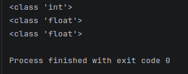
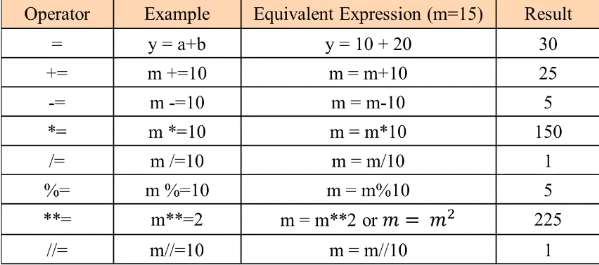
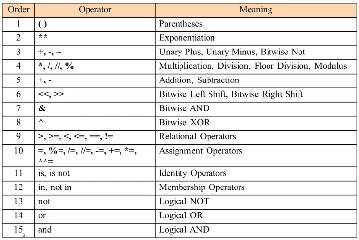

# MY PYTHON NOTES

## WE WILL WRITE THE NOTES HERE TO UNDERSTAND AND REVISE EVERYTHING FURTHER . WE WILL DESCRIBE EVERYTHING WITH THE REFERENCE OF THE FILE ABOVE THE DESCRPTION . AFTER THIS YOU CAN PROCEED WHAT YOU WAN TO LEARN AND HOW IT IS DESCRIBED IN THE RELATED Python FILE

### FILE: [IDENTIFIERS:](revision_python_gate/02_identifier.py)

- identifier is a name having a few letters , numbers and special characters_
- python is case-sensitive
- constant is identifier you can not see the concept of constant in python so you can not define a constant basically ,you have to ,manually think that this variable is a constant

### FILE: [VARIABLES:](revision_python_gate/03_variable.py)

- In python, you only bind a name to an object during assignment python consider value as objects
- memory allocation in python is based upon the value that variable carries not upon the variable
- if a value is in memory, it is allocated. that is how they save memory in python
- a variable is considered as tag that is tied to some value

### FILE: [DATATYPES:](revision_python_gate/04_datatype.py)

 - You do not declare the datatype in python , you simply write the value and assign a variable to it , python will understand the datatype automatically
 - datatype represents the type of data stored into a variable or memory
 - built in datatype and user-defined datatype
 - built-in datatypes : none type , numeric type, sequences, sets , mappings
 - user-defined datatypes : array , class , module
 - none type : none datatype represents an object that does not contain any value 
 - numeric type : int, float, complex, boolean
 - 
 - Why we get an output like this ?? because everything in python is an object and classes define what that object is and what they do 
###### - numeric type:
- ##### Int:
1. Int datatype is for integer numbers 
2. all whole numbers are integers
3. in python, you can represent very large size integer /no limit of size of an int datatype

- ##### Float:
1. contains decimal point ex : 7.9, 0.789, 5.9e5
2. e is scientific notation where e represents exponentiation which represents the power of 10 so 5.9e5 means 5.9*10<sup>5</sup>

- ##### Complex: 
1. written format : a+bj or a+bJ where a = real part of the number(int or float) and b = imaginary part of the number(int or float) and j or J = $\sqrt{-1}$
e.g. 5+6j , 0.4+3j, 3+0.3j

- ##### Bool type:
1. boolean value True as 1 or False as 0

###### - sequence type:
- ##### string: 
1. represents a group of characters
2. enclosed with double or single quotes

- ##### list: 
1. represents a group of element
2. can store different types of elements
3. can be modified
4. due to its dynamic property size is not fixed 
5. represented using ```[]```  e.g. ```[10, 20, -90, 'Z']```

| array | value |
|-------|-------|
| [0]   | 10    |
| [1]   | 20    |
| [2]   | -90   |
| [3]   | Z     |

- ##### tuple:
1. represents a group of elements with different datatypes
2. similar to "List" but tuples are read-only
3. can not be modified
4. represented using ```()``` e.g. ```(10,30,-3.5,'swarup')```

- ##### range:
1. represents a sequence of numbers
2. can not be modified and contains numbers only
3. rg1 = range(5) rg2 = range(10,20,2)(initialization,final goal,difference gap)


######  - Set type
1. unordered collection of elements means order is not maintained 
2. does not accept duplicate elements
3. due to its unordered property its elements can not be accessed using index 
4. represented using ```{}``` e.g. ```{10,20,30,"swarup"}```


###### - Mapping type/Dictionary
1. represents a group of elements in the form of key value pairs 
2. e.g. data{101: 'Rahul', 102: "Amit",103: "Swarup"}
3. ordered pair according to insertion


### FILE: [OPERATORS:](revision_python_gate/05_operator.py)
- An operator is a symbol that performs an operation
1. arithmetic operator
    - ```+ -> addition```
    - ```- -> substraction```
    - ```* -> multiplication```
    - ```/ -> division```
    - ```% -> modulus```
    - ```** -> exponent```
    - ```// -> integer division / floor division```
2. relational operator/ comparison operator
    - used to compare the value of operands to produce a logical value in True or False
    - ```less than -> <```
    - ```greater than -> >```
    - ```less than or equal to -> <=```
    - ```greater than or equal to -> >=```
    - ```equal to -> ==```
    - ```not equal to -> !=```
   
3. logical operator
    - used to form a complex expression called logical expression
    - the value obtained by evaluating a logical expression is always logical i.e. either True or False
    - 
      | operator | meaning     | example     | result |
      |----------|-------------|-------------|--------|
      | and      | logical and | 5<2 and 5>3 | false  |
      | or       | logical or  | 5<2 and 5>3 | true   |
      | not      | logical not | not(5<2)    | true   |
    - if true and expression then result is expression
    - if false and expression then result is false
    - if true and expression1 and expression2 then result is expression2
    - if true or expression then result is true
    - if false or expression then result is expression
    - if true or expression1 or expression2 then result is true 
    - if false or expression1 or expression2 then result is expression1 
    - anything after not if it is true then false if false then true 
    - any expression after not results false 
   
4. assignment operator:
    - assignment operators are used to perform arithmetic operation while assigning a value to a variable 
    - 
   
5. bitwise operator:
    - used to perform operations at binary digit level.
    - not commonly used
   
6. membership operator:
    - used to test for membership in a sequence such as string, lists, tuples, dictionaries.
    - two types : in and not in
         1. in : operator used to find an element in the specified sequence. it will return true if the element is found in the specified sequence else it will return false .
         2. not in: operator used to find an element in the specified sequence. it will return true if the element is not found in the specified sequence else it will return false .
           
7. identity operator:
    - identity operator compares the memory locations of two objects. Hence, it is possible to know whether2 objects are same or not .
    - two types : is and 
         1. is : 
            - used to compare if 2 objects are same or not 
            - returns True if memory location of 2 objects are same else False
         2. is not : 
            - works in reverse manner of ```is```.
            - returns True if memory location of 2 objects are npt same else false
            
#### Operator precedence and associativity :
- Computer scans the expression which contains the operators, from left to right and performs one operation at a time.
- The expression will be scanned many times to produce the result. The order in which various operations are performed is known as operator precedence. 
- Some of the operators of the same level of precedence are evaluates from left to right or right to left which is referred to associativity.
- 

### FILE: [IMPLICIT EXPLICIT TYPE CONVERSION:](revision_python_gate/06_typeconversion.py)


### FILE: [INPUT-OUTPUT STATEMENT:](revision_python_gate/07_outputstatement.py)
- escape sequence:
  1. escape sequences are control characters used to move the cursor and print characters such as ',".\ and so on.
  2. | escape sequence | meaning                        |
     |-----------------|--------------------------------|
     | \a              | bell                           |
     | \b              | backspace                      |
     | \f              | formfeed                       |
     | \n              | new line                       |
     | \r              | carriage return                |
     | \t              | horizontal tab                 |
     | \v              | vertical tab                   |
     | \new line       | backslash and new line ignored |
     | \\              | backslash                      |
     | \'              | single quote                   |
     | \''             | double quote                   |


### FILE: [IF-ELSE STATEMENT:](revision_python_gate/08_ifelse.py)


### FILE: [LOOPS:](./revision_python_gate/09_loops.py)
- used when a section of code may either be executed a fixed number of times or while some condition is true 
    1. while:
        - A Python while loop is a control flow statement used to repeatedly execute a block of code as long as a specified boolean condition remains True.
        - It is primarily used when the exact number of iterations is unknown before the loop starts.
        - while loop with else : while(condition):
                                        Statement 1
                                 else:
                                        Statement 2
                                 Rest of the code 
        - nested while loop : while(condition) :
                                        statements
                                        while(condition):
                                            statements                                        
                              rest of code                                                   
    2. for:
        - useful to iterate over the elements of sequence such as string, list , tuple etc
        - syntax: for variable in sequence:
                              statements
                      rest of the code
        - for loop is useful to iterate over the elements of sequence such as string, list, tuple etc. The else suite will always be executed irrespective of the statement in the loop are executed or not.
        - for loop inside another for loop is known as nested for loop.


### FILE: [RANGE() FUNCTION:](./revision_python_gate/10_rangefunction.py)
- RANGE() FUNCTION is used to generate a sequence of integers starting from 0 by default, and increments by 1 by default, till j-1.
- Syntax: range(start,stop,stepsize)
    1. start - starting position . if we do not mention start by default it's 0
    2. stop - ending position . range of integers stops one element prior to stop. if stop is j then it will stop at exact j-1
    3. stepsize - increment by step size . if we do not mention start by default it is 1 
    

### FILE: [BREAK AND CONTINUE:](./revision_python_gate/12_breakcontinue.py)   
- Break statement: used to jump out of loop to process the next statement in the program.
- syntax: while condition:
                if(condition):
                          break
          Rest of code  
- Continue statement: used in a loop to go back to the beginning of the loop
- syntax: while condition:
                    if(condition):
                            continue
          rest of code  


### FILE: [PASS STATEMENT:](./revision_python_gate/13_passstatement.py)
- pass statement is used inside a loop or if statement to represent no operation
- useful when a statement is syntactically correct ,but we don't need to do any operation
  - syntax : if(conditions):
                        pass
            else:
                        statements


### FILE: [ARRAYS:](./revision_python_gate/14_arrays.py)      
- array is an object that provide a mechanism for storing several data items with only one identifier, thereby simplifying the task of data management, Array is beneficial if you need to store group of elements of same datatype.
- python, arrays can increase or decrease their size dynamically.
- array can store only one type of data
- size of array is not fixed 
- array can increase or decrease their size dynamically
- array and list are not same 
- array uses less memory than list.
- type of array :
    1. one-dimensional array: single row multiples columns
            ex: student's roll number
    2. multidimensional array: multiple rows multiple columns
            ex: student's subjects marks
- ```import array``` : this will import the entire array module  
  ###### syntax: 
  ``` 
    import array
    array_name = array.array('type_code',[elements])
  ```
  - array_name: (object of array class)
  - array: module name
  - array: class name
  - ```from array import*``` : this will import all class , objects , variable
    ###### syntax:
    ```
    from array import*
    array_name = array('type code',[elements])
    ```
    - array_name: (object of array class)
    - array: class name
    - ```*``` : all 
    ##### TYPE CODE:
    | Type code | c type             | python type | size in bytes |
    |-----------|--------------------|-------------|---------------|
    | b         | signed char        | int         | 1             |
    | B         | unsigned char      | int         | 1             |
    | h         | signed short       | int         | 2             |
    | H         | unsigned short     | int         | 2             |
    | i         | signed int         | int         | 2             |
    | I         | unsigned int       | int         | 2             |
    | l         | signed long        | int         | 4             |
    | L         | unsigned long      | int         | 4             |
    | q         | signed long long   | int         | 8             |
    | Q         | unsigned long long | int         | 8             |
    | f         | float              | float       | 4             |
    | d         | double             | float       | 8             |
  
  - index: an index represents the position number of an array's element
  - accessing array using for loop: 
    1. without index
    2. with index

### FILE: [APPEND:](revision_python_gate/15_append.py)
- this method is used to add an element at the end of the existing array
  Syntax: array_name.append(new_element)
- array_name: (object of array class)

### FILE: [USER INPUT IN ARRAY](revision_python_gate/16_arrayinput.py)
- used to insert an element in a particular position of the existing array
- syntax: array_name.insert(position_number,new_element)

### FILE: [POP METHOD](revision_python_gate/18_pop.py):
- used to remove last element from the existing array
  Syntax : array_name.pop()
- used to remove an element specified by position number, from the existing array and returns removed element
  Syntax : array_name.pop(position_number)

### FILE: [REMOVE METHOD](revision_python_gate/19_remove.py)
- used to remove first occurrence of given element from the existing array . if it does not found the element shows value error

### FILE: [INDEX METHOD](revision_python_gate/20_index.py)
- return the position number of 1st occurrence of given element in the array. 
- if it won't find any element , shows value Error

### FILE: [REVERSE METHOD](revision_python_gate/21_reverse.py)
- used to reverse the order of elements in the array
- syntax : array_name.reserved(element)

### FILE: [EXTEND METHOD](revision_python_gate/22_extend.py)
- used to append another array or iterable object at the end of the array.
- syntax : array_name.extend(arr)

### FILE: [SLICING ON ARRAY](revision_python_gate/23_slicing.py)
- slicing on arrays can be used to retrieve a piece of the array that contains a group of elements. 
- useful to retrieve a range of elements
- syntax: ```new_array_name = array_name[start:stop:stepsize]```

#### A brief description about pip: pip is the package manager for python , using pip we can install python packages. when you download python it automatically gets installed into your computer.
#### to check pip version ```pip --version```
#### to update pip ```python -m pip install --upgrade pip```  or  ```py -m pip install --upgrade pip```
#### to get help ```pip help```
#### to install packages ```pip install (package name in camelcase)```
#### to use packages ```import (package name in camelcase)```
#### to uninstall ```pip uninstall (package name in camel case)```
- numpy is a package contains classes , functions , variables , large library of mathematical functions to work with scientific calculation 
- numpy can be used to create n dimensional array where n is any integer
- numpy array is also called "ndarray", also known as "alias name array". 
- to install ```pip install numpy```
- import ways : 
    1. import numpy - this will import the entire numpy module.
    2. from numpy import* - this will import all class , objects, variable etc from numpy package . Here * means all.
- single row multiple columns.
  ex: [101, 102, 103, 104, 105]
- ##### ways of creating array in numpy : 
1. array() function
2. linespace() function
3. logspace() function
4. arange() function
5. zeros() function
6. ones() function
### FILE: [1D NUMPY ARRAY](revision_python_gate/24_1Dnumpyarray.py)
- syntax : 
    ```
              import numpy
              array_name = numpy.array([elements])
    ```
                   0R
    ```
              from numpy import*
              array_name = array([elements])
    ```

### FILE: [NUMPY 1D ARRAY USING  LINSPACE FUNCTION](revision_python_gate/25_linspace1D.py)
- this function is used to create an array with evenly spaced numbers between a start point and stop point 
- syntax : ```numpy.linspace(start, stop , num = 50 , endpoint = True , retstep = False , dtype = None , axis=0)```
- start - it represents starting element 
- stop - represents ending element
- num - it represents number of parts the element should be divided. Default is 50 . It must be non-negative  
- endpoint - if true , stop is the last element . if false , stop is not included 
- syntax :
    ```
  from numpy import*
  array_name = linspace(start, stop, num = 50 , endpoint = True  )
    ```

### FILE: [NUMPY 1D ARRAY USING LOGSPACE FUNCTION](revision_python_gate/26_logspace1D.py)
- used to create an array with evenly spaced numbers logarithmically 
- The sequence starts at base ** start (base to the power of start) and ends with base ** stop 
- syntax: 
        ```
        numpy.logspace(start, stop , num = 50, endpoint = True, base = 10.0, dtype = None , axis =0)
        ```
- start - it represents starting element which will become base to the power of start(base <sup>start</sup>)
- stop - represents ending element which will become base to the power of stop (base <sup>stop</sup>)
- num - represents number of parts the elements should be divided . Default is 50 . It must be non-negative
- endpoint - if true , stop is the last element, If false, stop is not included
- base - the base of the log space
- dtype - the type of output array


### FILE: [NUMPY 1D ARRAY USING ARANGE FUNCTION](revision_python_gate/27_arange1D.py)
- used to create an array with a group of elements from start to one element prior to stop in steps of stepsize
- syntax: numpy.arange(start, stop, stepsize, dtype=None)
- start - start of interval. Interval includes this value . Default start value is 0
- stop - end of interval . Interval does not include this value, except in some cases where step is not an integer and floating point round-off affects the length of out.
- stepsize - spacing between values. Default step size is 1 
- dtype - the type of output array 
- syntax: 
        ```
          from numpy import*
          array_name = arange(start, stop, stepsize, dtype = None)
        ```
